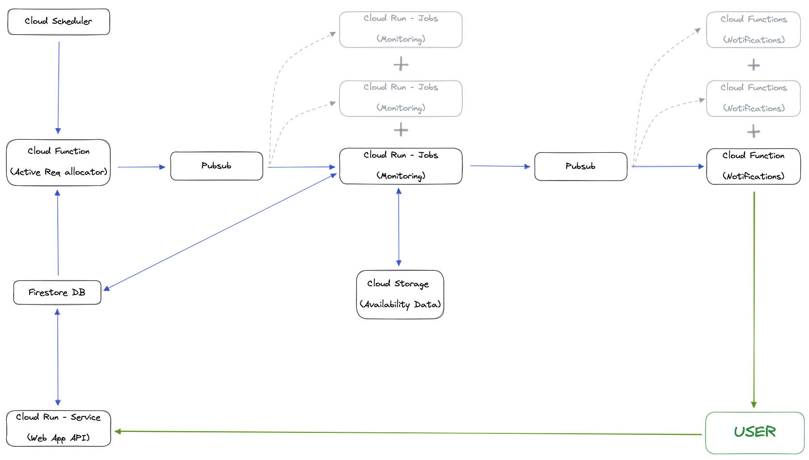

# Lantern Showcase

Lantern is an outdoor recreation monitoring and alerting service. Each year recreation.gov releases reservation slots and permits for many recreation sites across the United States allowing a controlled amount of visitors to experience the beauty of our nearby nature. For the most popular recreation sites, these reservations get snatched up quickly! However, many reservations get canceled at the last minute. Lantern allows anyone to monitor these recreation sites for last minute availability. For instance, when a user wants to go camping they submit details about their desired trip such as campsite type, presence of campsite attributes (e.g. electricity or water hookup), campsite size, or even a set of campsite numbers. Lantern will monitor recreation.gov for the availability of campsites making their trip feasible and send them a notification alerting when their desired trip and preferences are available.

Lantern is composed of two components, a user facing API written with the [Go Gin framework](https://github.com/gin-gonic/gin) and a monitoring program.

Below is a diagram showing how the monitoring program and the API are connected via a GCP Firestore instance. 

This showcase contains two snippets of code from Lantern, one from the API and the other from the monitoring program.
## sample_monitoring.go

The code included in this sample is a snippet from the monitoring portion of the application. Its responsibility is to retrieve new campsite availability data from the recreation.gov API, compare the data to old campsite availability data, and construct a list of availability changes that will later be used to update subscriber information and send notifications to users when necessary.

## sample_api.go

This code snippet presents a function called addTripProcedures. This function is called by POST and PUT requests to the trip endpoint of the API. Users call this endpoint to add and update details of their camping trips. Updating a camping trip can require updates to up to 4 different collections (tables) in Firestore. This function receives a list of procedures indicating which Firestore collections require updates. As the function loops through the list of procedures, it records which procedures it has partially or fully completed thus far. If at any moment one of the database updates errors then the function returns the list of completed procedures along with details about each procedure. Then another function is called to undo all the previously completed database updates. This ensures the updates to the database are atomic. If no error occurs then the function returns nil for the error value indicating all procedures completed successfully.
